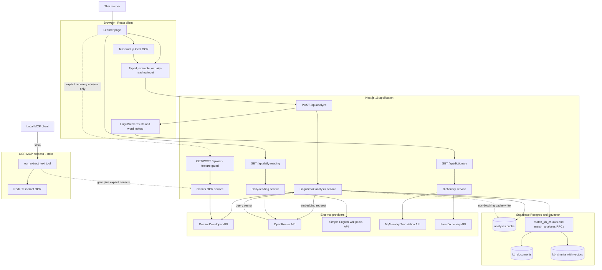
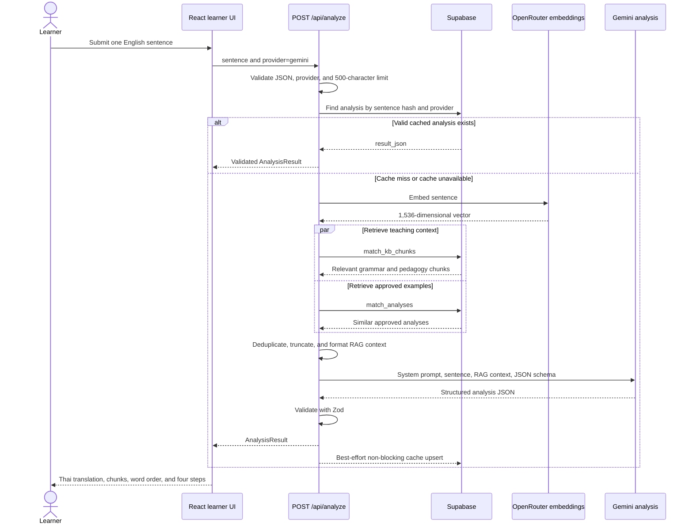
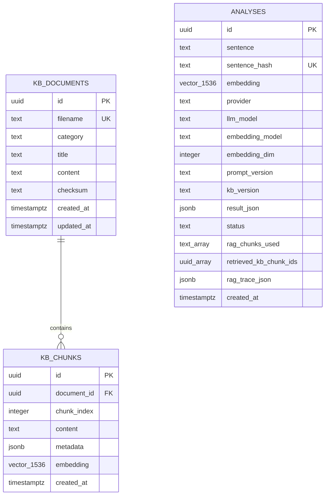

# Caffeine

Caffeine is a public, AI-assisted English sentence-understanding tool for Thai learners. Its main experience, **LinguBreak**, turns one English sentence into:

- grammatical chunks with English and Thai explanations
- the core Subject–Verb–Object structure
- a natural Thai translation
- the original chunks reordered for Thai-friendly processing
- four guided steps for understanding and rebuilding the sentence
- tappable vocabulary with Thai meanings and optional English dictionary details

This README is the primary project handover document. It describes the system that is implemented in this repository today, how its components interact, how to operate it, and which boundaries are intentionally left for future work.

## Current product scope

The current demo includes:

- a public learner page with typed, daily-reading, example, and image-scan inputs
- Gemini-powered structured sentence analysis
- a Supabase/pgvector retrieval-augmented generation (RAG) pipeline
- local browser OCR with Tesseract.js
- an explicitly gated, consent-based Gemini cloud OCR recovery path
- a root-confined stdio MCP tool for local image OCR
- non-LLM English-to-Thai vocabulary lookup
- HTTP-cacheable daily readings and dictionary responses, plus persisted sentence analyses

Authentication, teacher tools, lesson management, transcription, background jobs, and automatic AI-provider fallback are not part of the current runtime product. Historical SQL for some of those removed domains remains in `scripts/` for audit purposes and must not be treated as active application schema.

## Technology stack

| Layer | Technology | Responsibility |
| --- | --- | --- |
| Web application | Next.js 16 App Router, React 19, TypeScript | Learner UI and server API routes |
| Styling | Tailwind CSS v4 | Responsive learner interface |
| Runtime validation | Zod | AI, daily-reading, and dictionary response contracts |
| Sentence analysis | Gemini `gemini-3.6-flash` | Structured English/Thai pedagogical analysis |
| Daily reading generation | OpenRouter `openrouter/free` | Adapts reviewed source material to A2–B1 English |
| Embeddings | OpenRouter `openai/text-embedding-3-small` | 1,536-dimensional query and knowledge-base vectors |
| Data and vector search | Supabase Postgres + pgvector | Knowledge base, similarity search, provenance, and analysis cache |
| Vocabulary providers | MyMemory + Free Dictionary API | Thai meaning and optional English details |
| OCR | Tesseract.js; optional Gemini `gemini-2.5-flash` through `@google/genai` | Local-first image-to-text with an explicit cloud recovery path |
| MCP | Model Context Protocol TypeScript SDK v2 over stdio | Root-confined OCR automation for local clients |

## System architecture

The application is a modular Next.js monolith. The browser communicates only with same-origin App Router endpoints. Server-only routes and libraries own provider credentials and the Supabase service-role key.



### Component responsibilities

| Component | Primary path | Responsibility |
| --- | --- | --- |
| Learner page | `src/app/(student)/page.tsx` | Composes sentence input and result views |
| Sentence input | `src/features/lingubreak/components/SentenceInput.tsx` | Selects typed, example, reading, or scan input |
| Analysis client state | `src/features/lingubreak/hooks/useAnalyze.ts` | Calls `/api/analyze` and owns loading/error/result state |
| Analysis boundary | `src/app/api/analyze/route.ts` | Validates public requests, maps provider errors, returns JSON |
| Analysis orchestration | `src/features/lingubreak/lib/ai-providers.ts` | Cache lookup, RAG retrieval, Gemini generation, validation, cache write |
| RAG retrieval | `src/shared/lib/rag/` | Embeds input, queries pgvector, bounds and formats prompt context |
| Daily reading | `src/features/daily-reading/` | Selects a reviewed topic, fetches its source, and creates a learner adaptation |
| Dictionary | `src/features/dictionary/` | Normalizes a selected word and combines Thai and English provider results |
| Local OCR | `src/shared/lib/ocr/tesseract-ocr.ts` | Runs OCR in the learner's browser without uploading the image |
| Cloud OCR | `src/app/api/ocr/route.ts` | Reports availability and accepts only gated, same-origin, explicitly consented Gemini requests |
| OCR MCP server | `src/mcp/` | Exposes one stdio OCR tool with local Tesseract by default and confines reads to an allowed root |
| Database client | `src/shared/lib/db/supabase.ts` | Creates the server-only Supabase service-role client |
| Environment contract | `src/env/schema.ts` | Defines required and optional server environment variables |

## Sentence-analysis flow

`POST /api/analyze` is the core application path. The service checks the analysis cache before doing any embedding or generation work. A cache miss retrieves both relevant knowledge-base chunks and approved prior analyses, then asks Gemini for a schema-constrained result.



### Analysis contract

The validated `AnalysisResult` contains:

| Field | Meaning |
| --- | --- |
| `chunks` | Every source word grouped into typed grammatical units |
| `simplified_english` | Core SVO sentence with modifiers removed |
| `thai_translation` | Natural Thai translation |
| `thai_reordered_chunks` | The same chunks ordered for Thai-language processing |
| `pedagogical_steps` | Four bilingual teaching steps with highlighted source text |

RAG is an enhancement, not a hard dependency of generation at request time. If embedding, retrieval, or Supabase access fails, the analysis service logs a warning and asks Gemini to analyze using the Thai-specific base prompt only. Cache read and write failures are also non-fatal. Gemini failure or invalid Gemini output is fatal for that request.

### Cache and provenance behavior

- Sentences are normalized with `trim().toLowerCase()` and converted to a small deterministic hash.
- `analyses` stores the original sentence, provider/model information, prompt and knowledge-base versions, result JSON, embedding, retrieved chunk IDs, and a RAG timing trace.
- Cached JSON is validated again before being returned.
- New cache writes are asynchronous and best effort; the response does not wait for persistence.
- Only rows with `status = 'approved'` are eligible as few-shot examples during retrieval.
- The current hash is not cryptographic and can theoretically collide. Revisit it before treating the cache as authoritative at high scale.
- A non-blocking write may be interrupted by short-lived serverless runtimes. Await the write or move it to a durable queue if cache completeness becomes operationally important.

## Supporting user flows

### Today's Reading

1. The learner opens **Today's Reading**.
2. `GET /api/daily-reading` chooses a deterministic topic for the current UTC day.
3. The service fetches an introductory extract from Simple English Wikipedia.
4. OpenRouter rewrites only the supplied facts into 60–100 words and exactly three or four A2–B1 sentences.
5. Zod verifies the paragraph, sentence list, source attribution, and CC BY-SA 4.0 metadata.
6. The response advertises a one-day shared-cache lifetime with one hour of stale-while-revalidate.
7. The learner chooses one generated sentence and sends it through the normal analysis path.

There is no application-level daily-reading database. Effective reuse depends on a CDN or reverse proxy honoring `s-maxage`.

### Image OCR

JPEG, PNG, and WebP images up to 10 MB are processed with Tesseract in the browser by default. Before OCR, the client verifies the actual file signature, MIME type, dimensions, and pixel count. HEIC/HEIF is selected deliberately so the UI can return an explicit conversion message rather than failing silently. Extracted text remains editable, is split into English sentences, and only the chosen sentence is submitted for analysis.

If local extraction fails or returns confidence below `0.55`, the UI offers **Improve with cloud OCR — image leaves this device** only when `OCR_CLOUD_ENABLED=true`. The image is never uploaded automatically. The learner must activate that action, and `POST /api/ocr` requires `cloudConsent=true` before it will call Gemini. The route is disabled by default, validates the same image boundaries again, rejects cross-origin browser requests, and returns sanitized provider failures.

The local stdio MCP server exposes exactly one tool, `ocr_extract_text`. It accepts a local image path, defaults to Tesseract, and returns the same validated `OcrResult` used by the application. File paths are resolved with `realpath` and must remain beneath `OCR_MCP_ALLOWED_ROOT`; URLs, traversal, symlink escape, missing files, and unsupported formats are rejected. Gemini use through MCP has the same feature gate and explicit `cloudConsent: true` requirement.

```bash
OCR_MCP_ALLOWED_ROOT=/absolute/safe/image/root npm run mcp:ocr
```

### Vocabulary lookup

Selecting an English word calls `GET /api/dictionary?word=...`:

- MyMemory is required for the Thai meaning.
- Free Dictionary API is optional and adds pronunciation, part of speech, definition, example, and audio.
- Both requests run in parallel with eight-second timeouts.
- If Free Dictionary fails, the API returns a valid partial response containing the Thai meaning.
- If MyMemory fails or returns no translation, the request fails.
- Successful responses advertise a one-day shared-cache lifetime and seven days of stale-while-revalidate.

No LLM or project API key is used for vocabulary lookup.

## Data architecture

Only three tables and two RPC functions are required by the current demo core.



| Database object | Purpose |
| --- | --- |
| `kb_documents` | Source Markdown documents and ingestion checksums |
| `kb_chunks` | Searchable document chunks with HNSW-indexed 1,536-dimensional embeddings |
| `analyses` | Cached results, retrieval provenance, and approved examples |
| `match_kb_chunks` | Cosine-similarity search over knowledge chunks |
| `match_analyses` | Cosine-similarity search over approved past analyses |

The application uses a Supabase service-role key and therefore bypasses normal client-level authorization. Never import `src/shared/lib/db/supabase.ts` into a client component or expose `SUPABASE_SERVICE_ROLE_KEY` through a `NEXT_PUBLIC_` variable.

## API reference

The learner routes are public and currently have no application authentication or application rate limiter. Cloud OCR adds a deny-by-default feature gate, explicit user consent, same-origin enforcement, and deployment-level controls; those controls are not user authentication.

| Method and path | Request | Success | Main errors | Cache policy |
| --- | --- | --- | --- | --- |
| `POST /api/analyze` | JSON `{ "sentence": string, "provider"?: "gemini" }` | `200` `AnalysisResult` | `400`, `429`, `500` | Supabase application cache |
| `GET /api/daily-reading` | None | `200` `DailyReading` | `503` | `s-maxage=86400`, SWR 1 hour |
| `GET /api/dictionary?word=...` | One normalized English word, maximum 50 characters | `200` full or partial lookup | `400`, `404`, `502` | `s-maxage=86400`, SWR 7 days |
| `GET /api/ocr` | None | `200` `{ "enabled": boolean }` | None | `no-store` |
| `POST /api/ocr` | Multipart `image`, `cloudConsent=true`; optional `mode=text|smart` | `200` `OcrResult` | `400`, `403`, `404`, `413`, `422`, `429`, `500` | None |

Example analysis request:

```bash
curl -X POST http://localhost:3000/api/analyze \
  -H 'Content-Type: application/json' \
  -d '{"sentence":"The student who studied hard passed the exam.","provider":"gemini"}'
```

The route registry lives in `infra/gateway-routes.yaml`. Run `npm run check:routes` whenever adding, removing, or renaming an API namespace.

## Repository structure

```text
src/
  app/
    (student)/page.tsx          Public learner experience
    api/analyze/route.ts        Sentence-analysis boundary
    api/daily-reading/route.ts  Daily-reading boundary
    api/dictionary/route.ts     Vocabulary boundary
    api/ocr/route.ts            Gated cloud OCR boundary
  env/
    schema.ts                   Environment contract
    server.ts                   Server-only parsed environment
  features/
    daily-reading/              Reading UI, source selection, generation, schemas
    dictionary/                 Lookup UI, client state, providers, schemas
    lingubreak/                 Analysis UI, client state, providers, schemas
    ocr/                        Upload, camera, editing, and OCR client state
  shared/lib/
    db/                         Supabase service-role client
    health/                     Live dependency health checks
    ocr/                        Shared validation, schemas, local OCR, cloud OCR
    rag/                        Embeddings, retrieval, chunking, context formatting
    text/                       English sentence splitting
  config/rag.ts                 RAG limits and provenance versions
  mcp/                          Root-confined stdio OCR server and tool
knowledge-base/
  grammar/                      English grammar references
  errors/                       Common Thai learner mistakes
  pedagogy/                     Thai-oriented teaching methods
scripts/                        Database, ingestion, health, contract, and smoke tools
infra/                          Route registry and example Nginx reverse proxy
docs/                           Design, operations, and historical migration notes
```

## Local development

### Prerequisites

- Node.js 20 or a compatible newer LTS release
- npm
- a Supabase project with pgvector available
- an OpenRouter API key with access to embeddings
- a Gemini Developer API key with access to the configured models

### Setup

1. Install dependencies:

   ```bash
   npm install
   ```

2. Copy the environment template:

   ```bash
   cp .env.example .env.local
   ```

3. Add the required values:

   ```env
   NEXT_PUBLIC_SUPABASE_URL=
   SUPABASE_SERVICE_ROLE_KEY=
   OPENROUTER_API_KEY=
   GEMINI_API_KEY=
   OCR_CLOUD_ENABLED=false
   GEMINI_OCR_MODEL=gemini-2.5-flash
   ```

4. For a brand-new, empty Supabase project, run `scripts/setup-db.sql` in the Supabase SQL Editor.

   **Warning:** this is a clean-reset script. It drops the current RAG tables and functions before recreating them. Never run it against a database containing data that must be retained. Follow `docs/SUPABASE_SQL_EDITOR.md` for an existing deployment.

5. Ingest the repository knowledge base:

   ```bash
   npm run ingest
   ```

6. Start the application:

   ```bash
   npm run dev
   ```

7. Open [http://localhost:3000](http://localhost:3000).

### Environment variables

| Variable | Required | Used for |
| --- | --- | --- |
| `NEXT_PUBLIC_SUPABASE_URL` | Yes | Supabase project URL; safe to identify the project publicly |
| `SUPABASE_SERVICE_ROLE_KEY` | Yes | Server-only RAG reads and cache writes |
| `OPENROUTER_API_KEY` | Yes | Embeddings and daily-reading generation |
| `GEMINI_API_KEY` | Yes | Sentence analysis; also cloud OCR when explicitly enabled |
| `OCR_CLOUD_ENABLED` | No | Enables cloud OCR only when set exactly to `true`; defaults to disabled |
| `GEMINI_OCR_MODEL` | No | Cloud OCR model override; defaults to `gemini-2.5-flash` |
| `OCR_MCP_ALLOWED_ROOT` | No | Filesystem root readable by the OCR MCP tool; defaults to its working directory |
| `OPENAI_API_KEY` | No | Dormant direct OpenAI embedding adapter |
| `DEEPSEEK_API_KEY` | No | Dormant direct DeepSeek analysis adapter |
| `RAG_*` variables | No | Retrieval counts, similarity thresholds, and prompt-size limits |
| `LINGUBREAK_PROMPT_VERSION` | No | Analysis provenance override |
| `KB_INGEST_VERSION` | No | Knowledge-base provenance override |

Keep `.env.example`, `.env.production.example`, and `src/env/schema.ts` synchronized when the environment contract changes.

## Knowledge-base operations

`npm run ingest` reads every Markdown file below `knowledge-base/`, splits it by headings and size, embeds each chunk through OpenRouter, and stores the document and chunks in Supabase.

- A document checksum prevents unchanged files from being re-ingested.
- Missing chunks for an otherwise unchanged document are backfilled.
- Changed documents have their old chunks and document row replaced.
- Embedding calls retry up to three times with exponential backoff.
- The application and database must keep the embedding model and dimension aligned. The current contract is `openai/text-embedding-3-small` at 1,536 dimensions.

After changing knowledge-base content:

1. Update `KB_INGEST_VERSION` if the release needs explicit provenance.
2. Run `npm run ingest` against the intended Supabase project.
3. Run `npm run health:api` and confirm both RAG RPC checks pass.
4. Test a sentence that should retrieve the changed material.

## Validation and operational commands

| Command | Purpose | External calls or prerequisites |
| --- | --- | --- |
| `npm run dev` | Start the development server | Local environment |
| `npm run build` | Create a production build | Valid environment may be required |
| `npm run start` | Run the production build | Run `build` first |
| `npm run typecheck` | Run TypeScript without emitting files | None |
| `npm run lint` | Run ESLint | None |
| `npm run check:env` | Validate keys and environment templates | Loads `.env.local` |
| `npm run check:content-inputs` | Validate daily-reading, sentence-splitting, route, and camera contracts | Static/local checks |
| `npm run check:dictionary` | Validate full and degraded dictionary responses | Uses test doubles |
| `npm run check:learner-ui` | Validate Thai-first result and vocabulary contracts | Static/local checks |
| `npm run check:routes` | Compare App Router APIs with gateway and Nginx configuration | Static/local checks |
| `npm run check:ocr` | Validate schemas, image boundaries, route gates, path confinement, and real-image local OCR | Downloads/caches Tesseract English data on first run |
| `npm run check:mcp:ocr` | Start the stdio MCP process, discover its one tool, and exercise success and rejection contracts | Local MCP subprocess and real-image OCR |
| `npm run e2e:ocr` | Upload the fixture in Chromium, edit extracted text, choose a sentence, and confirm no cloud upload | Playwright Chromium; starts the dev server |
| `npm run check:ocr:gemini-live` | Make exactly one real Gemini OCR fixture call | Skips unless `OCR_LIVE_GEMINI=1`; incurs provider usage |
| `npm run mcp:ocr` | Start the OCR MCP server over stdio | Set `OCR_MCP_ALLOWED_ROOT` to the intended safe root |
| `npm run health:api` | Probe environment, Gemini, OpenRouter, Supabase tables, embeddings, and RAG RPCs | Makes live provider calls |
| `npm run smoke:api` | Validate public HTTP behavior against a running server | Set `BASE_URL` when not local |
| `npm run ingest` | Embed and ingest the knowledge base | Writes to Supabase and uses OpenRouter credits |

Recommended pre-handover or pre-release verification:

```bash
npm run typecheck
npm run lint
npm run check:env
npm run check:content-inputs
npm run check:dictionary
npm run check:learner-ui
npm run check:routes
npm run check:ocr
npm run check:mcp:ocr
npm run e2e:ocr
npm run build
```

Then run the production server and smoke checks:

```bash
npm run start
BASE_URL=http://127.0.0.1:3000 npm run smoke:api
```

Run `npm run health:api` separately when live provider calls and their potential cost are acceptable.

## Deployment handover

The repository does not prescribe a single hosting provider. Deploy it as a Node-compatible Next.js application with the four required secrets configured. `infra/nginx.conf` is an example reverse-proxy configuration for a service named `next:3000`; adjust the upstream for the actual platform.

Before production cutover:

- configure the four required environment variables in the host's secret store
- apply and verify only the current RAG schema
- ingest the knowledge base into the production Supabase project
- verify the deployed gateway exposes every prefix in `infra/gateway-routes.yaml`
- run `npm run health:api` from a trusted environment
- run `BASE_URL=https://your-host npm run smoke:api`
- confirm the CDN or proxy preserves the daily-reading and dictionary cache headers
- add platform-level rate limiting, request-size enforcement, logging, and alerting for public endpoints
- define provider usage and budget alerts for Gemini and OpenRouter
- keep `OCR_CLOUD_ENABLED=false` unless the consent copy, provider terms, quotas, and gateway controls have been approved
- set `OCR_MCP_ALLOWED_ROOT` to the narrowest directory needed by each local MCP deployment

The service is stateless apart from Supabase and provider-side usage limits. Horizontal application scaling is possible, but the synchronous Gemini request remains the main latency and concurrency constraint.

## Failure modes and troubleshooting

| Symptom | Likely cause | First checks |
| --- | --- | --- |
| Analysis returns `429` | Gemini quota or rate limit | Run `npm run health:api`; inspect provider quota |
| Analysis returns `500` | Gemini key/model issue or invalid structured output | Check server logs and `GEMINI_API_KEY` |
| Analysis works but ignores project knowledge | OpenRouter embedding or Supabase/RPC failure | Run the embedding and RAG health checks; verify ingestion |
| Repeated sentences are not cached | Supabase access failure or interrupted non-blocking write | Inspect `analyses` and server logs |
| Today's Reading returns `503` | Wikipedia, OpenRouter, timeout, or schema failure | Inspect server logs and test both upstreams |
| Dictionary returns partial data | Free Dictionary API failed | Expected degradation; Thai meaning is still usable |
| Dictionary returns `502` | MyMemory failed or timed out | Retry and inspect provider availability |
| Scan is slow | Tesseract model loading or a large/unclear image | Use a smaller, clear, well-lit image |
| Cloud OCR action is absent | Cloud OCR is disabled by default | Set `OCR_CLOUD_ENABLED=true` only after approving the privacy and abuse controls |
| MCP rejects an image path | Path is outside `OCR_MCP_ALLOWED_ROOT`, escaped through a symlink, or is not a supported file | Use a real JPEG, PNG, or WebP file beneath the configured root |
| Local boot fails during environment parsing | A required key is absent or malformed | Run `npm run check:env` |
| Vector RPC reports a dimension error | Database schema and embedding model differ | Confirm both are configured for 1,536 dimensions |

Provider and RAG timings are written to server logs during analysis. There is no persistent metrics, tracing, or alerting backend in this repository.

## Security and privacy notes

- Learner APIs have no authentication, per-user quota, CAPTCHA, or application rate limiter. Cloud OCR is additionally deny-by-default and same-origin, but gateway rate limits are still required before enabling it.
- User sentences are sent to OpenRouter for embeddings, to Gemini for analysis, and may be stored in Supabase with the generated result and retrieval trace.
- Learner-image OCR runs locally by default. The cloud recovery action clearly states that the image leaves the device and requires an intentional click plus server-side consent validation.
- The MCP tool reads only real files beneath `OCR_MCP_ALLOWED_ROOT`; it rejects URL input, traversal, and symlink escape.
- Dictionary words are sent to MyMemory and Free Dictionary API.
- The daily-reading service sends public Wikipedia source text to OpenRouter.
- The Supabase service-role key must remain server-only and must never be logged or returned to clients.
- Provider errors returned to the browser are deliberately sanitized; use server logs for detailed diagnosis.

Before accepting personal, confidential, or student-identifying content, establish a retention policy, provider data-processing terms, consent requirements, and deletion workflow.

## Known limitations and deliberate trade-offs

- Analysis is synchronous; slow model responses hold the HTTP connection open.
- The provider type currently permits only Gemini. OpenRouter and DeepSeek analysis adapters are dormant and are not automatic fallbacks.
- RAG failures degrade silently to prompt-only analysis, improving availability but making reduced answer grounding less visible to the learner.
- Cache persistence is best effort and uses a small non-cryptographic sentence hash.
- Public cache headers rely on deployment infrastructure to provide shared caching.
- External free services have no repository-controlled availability guarantee.
- Local Tesseract OCR is private and inexpensive but can be slow and less accurate than hosted vision models.
- HEIC and HEIF are deliberately rejected until a bounded, tested conversion path is added.
- The OCR MCP transport is local stdio only; it does not expose a network service or watch files.
- There is no application-level observability, distributed rate limiting, background queue, or retry worker.
- Historical admin, lesson, translation, and transcription SQL may still exist in deployed databases even though the runtime no longer uses those domains.

## Where to make common changes

| Change | Start here | Also review |
| --- | --- | --- |
| Change analysis prompt or teaching method | `src/features/lingubreak/lib/ai-providers.ts` | `src/features/lingubreak/lib/schema.ts`, prompt version |
| Change Gemini analysis model | `GEMINI_ANALYSIS_MODEL` in `ai-providers.ts` | Health checks, README, provider quota |
| Tune RAG limits | `src/config/rag.ts` or `RAG_*` environment variables | Prompt size and latency |
| Change embedding model | `src/shared/lib/rag/embeddings.ts` | Database vector dimensions, setup SQL, ingestion |
| Add knowledge | `knowledge-base/` | Run ingestion and update KB version |
| Change result UI | `src/app/(student)/page.tsx` and `src/features/lingubreak/components/` | Learner UI contract check |
| Change daily topics or source | `src/features/daily-reading/lib/source.ts` | Attribution and content-input checks |
| Change dictionary providers | `src/features/dictionary/lib/lookup.ts` | Degraded response contract and cache policy |
| Change OCR provider or confidence threshold | `src/features/ocr/hooks/useOcr.ts` and `OcrInputPanel.tsx` | Shared schemas, privacy copy, upload limits, and `/api/ocr` |
| Change OCR validation limits | `src/shared/lib/ocr/ocr-types.ts` and `image-validation.ts` | Browser, API, MCP, fixtures, and contract checks |
| Change the OCR MCP tool | `src/mcp/ocr-tool.ts` | Allowed-root policy, shared output schema, and MCP contract check |
| Add or rename an API | `src/app/api/` | Gateway registry, Nginx, route and smoke checks |
| Change environment keys | `src/env/schema.ts` | Both environment example files and CI |

## Database migration warning

For the demo core, retain only `analyses`, `kb_documents`, `kb_chunks`, `match_kb_chunks`, and `match_analyses` unless an external consumer is known to need more.

Do not run these historical scripts as current demo setup:

- `scripts/create-admin-tables.sql`
- `scripts/create-transcriptions-table.sql`
- `scripts/migrate-rag-schema-evolution.sql`

See `docs/obsolete-database-objects.md` before removing old deployed objects. Database cleanup is intentionally separate from application handover because destructive migration requires deployment-specific verification.

## Future evolution

Revisit the architecture in this order as usage grows:

1. Add gateway-level throttling, budgets, and basic request telemetry.
2. Make analysis cache keys collision-resistant and include prompt/model/KB versions in cache invalidation.
3. Persist model and RAG metrics to an observability platform.
4. Move analysis to a durable asynchronous workflow if provider latency exceeds hosting limits.
5. Add an explicit, tested provider-fallback policy only when its quality and cost trade-offs are acceptable.
6. Separate API workers from the web application only when traffic or deployment constraints justify the operational complexity.

The browser already depends on stable same-origin API boundaries, so the analysis service can later move behind a gateway, function, or worker without redesigning the learner UI.
