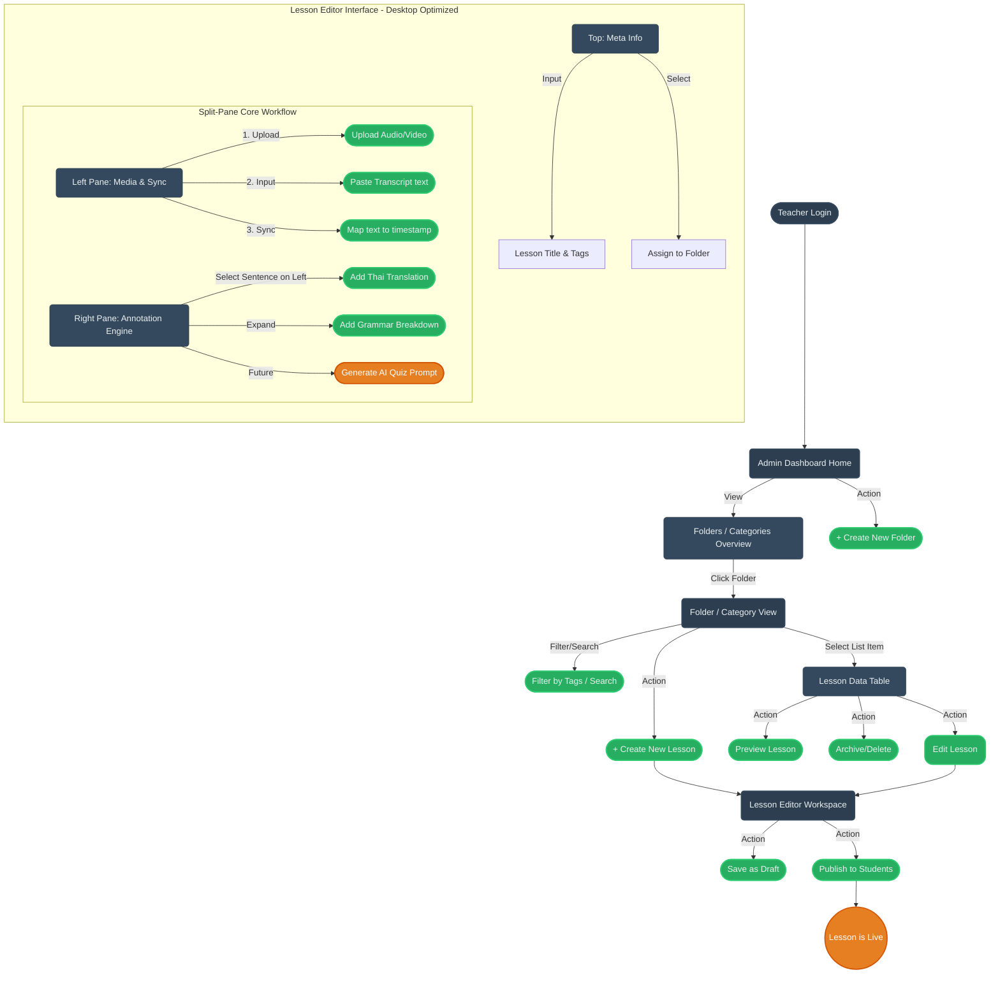

```mermaid
flowchart TD
    %% Define Styles
    classDef page fill:#2C3E50,stroke:#34495E,stroke-width:2px,color:#ECF0F1,rx:5px,ry:5px
    classDef action fill:#27AE60,stroke:#2ECC71,stroke-width:2px,color:#ECF0F1,rx:15px,ry:15px
    classDef state fill:#E67E22,stroke:#D35400,stroke-width:2px,color:#FFF,rx:5px,ry:5px
    classDef section fill:#34495E,stroke:#2C3E50,stroke-width:1px,color:#ECF0F1,rx:5px,ry:5px
    %% Flow Nodes
    Login(["Teacher Login"]):::page --> Dash("Admin Dashboard Home"):::page
    %% Dashboard
    Dash --> |View| Folders["Folders / Categories Overview"]:::section
    Dash --> |Action| CreateFolder(["+ Create New Folder"]):::action
    %% Inside a Category
    Folders --> |Click Folder| CategoryView("Folder / Category View"):::page
    CategoryView --> |Action| CreateLesson(["+ Create New Lesson"]):::action
    CategoryView --> |Filter/Search| SortTags(["Filter by Tags / Search"]):::action
    CategoryView --> |Select List Item| LessonTable["Lesson Data Table"]:::section
    %% Row options
    LessonTable --> |Action| QuickPreview(["Preview Lesson"]):::action
    LessonTable --> |Action| Archive(["Archive/Delete"]):::action
    LessonTable --> |Action| Edit("Edit Lesson"):::action
    %% The Core: Lesson Editor
    CreateLesson --> Editor("Lesson Editor Workspace"):::page
    Edit --> Editor
    %% Inside the Editor
    subgraph LessonEditor ["Lesson Editor Interface - Desktop Optimized"]
        direction TB
        Meta["Top: Meta Info"]:::section
        Meta --> |Input| Title["Lesson Title & Tags"]
        Meta --> |Select| FolderSelect["Assign to Folder"]
        subgraph SplitPane ["Split-Pane Core Workflow"]
            direction LR
            LeftPane["Left Pane: Media & Sync"]:::section
            RightPane["Right Pane: Annotation Engine"]:::section
            LeftPane --> |1. Upload| AudioUploader(["Upload Audio/Video"]):::action
            LeftPane --> |2. Input| Transcript(["Paste Transcript text"]):::action
            LeftPane --> |3. Sync| Timestamps(["Map text to timestamp"]):::action
            RightPane --> |Select Sentence on Left| Translation(["Add Thai Translation"]):::action
            RightPane --> |Expand| Grammar(["Add Grammar Breakdown"]):::action
            RightPane --> |Future| AIQuiz(["Generate AI Quiz Prompt"]):::state
        end
    end
    %% Publishing
    Editor --> |Action| SaveDraft(["Save as Draft"]):::action
    Editor --> |Action| Publish(["Publish to Students"]):::action
    Publish --> Live(("Lesson is Live")):::state
```
