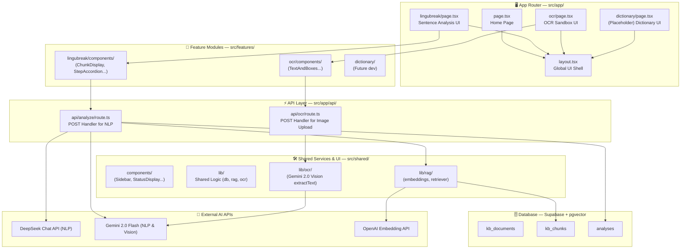
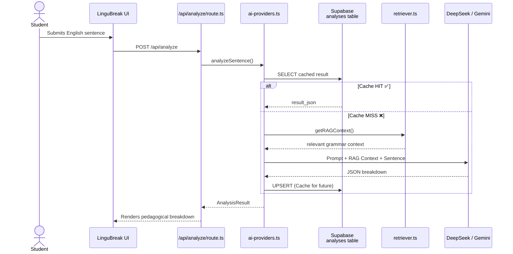
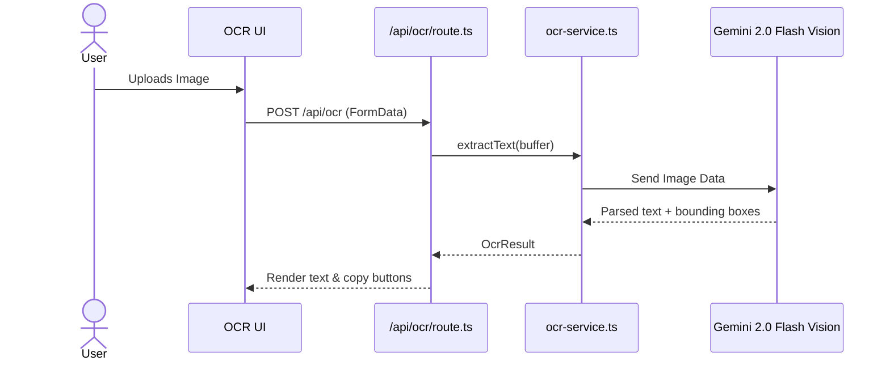
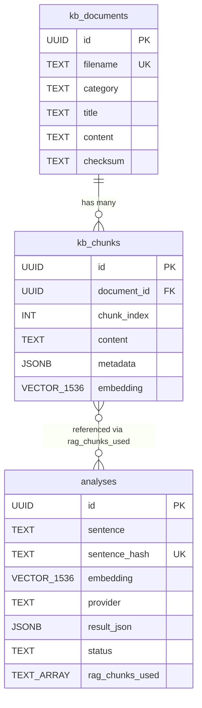
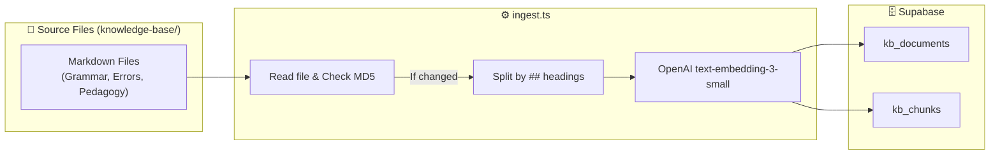
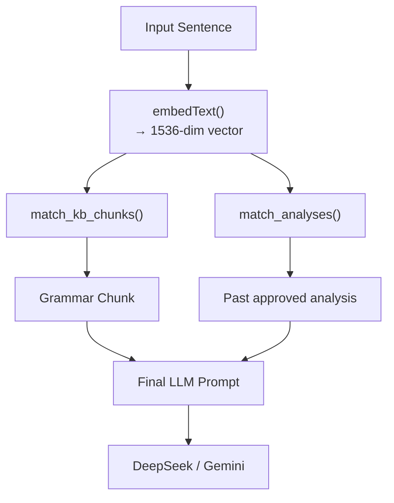

# Caffeine — Complete System Architecture

## 1. High-Level System Overview

---

## 2. Request Flows

### LinguBreak Feature (Sentence Analysis)

### OCR Feature

---

## 3. Database Schema — Entity Relationship

*(Currently heavily utilized by LinguBreak's RAG and caching systems)*

---

## 4. Knowledge Base Ingestion Pipeline

Used to populate the RAG context for LinguBreak analysis.

---

## 5. RAG Context Construction (LinguBreak)

---

## 6. Development Philosophy & Scaling

The architecture has shifted from a single-app (LinguBreak) MVP to a **multi-feature workspace (`Caffeine`)**. 

- **App Router (`src/app/`)**: Thin glue layer mounting the features and exposing API routes.
- **Feature Modules (`src/features/`)**: Self-contained vertical slices. Each MVP (LinguBreak, OCR, Dictionary) manages its own specialized components, types, and logic.
- **Shared (`src/shared/`)**: Generic UI blocks (Sidebar, layout), reusable hooks, and foundational backend libraries (DB clients, RAG engines, external API wrappers).
