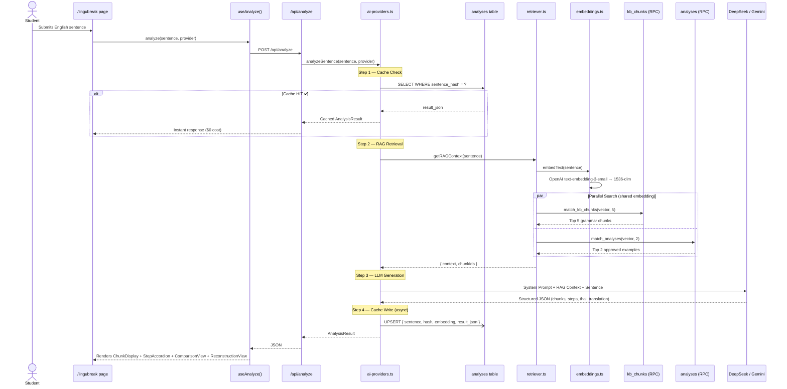
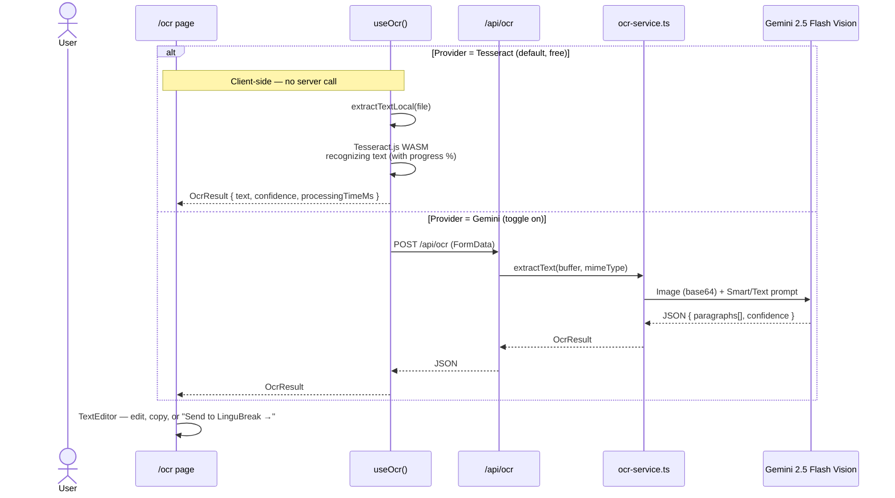
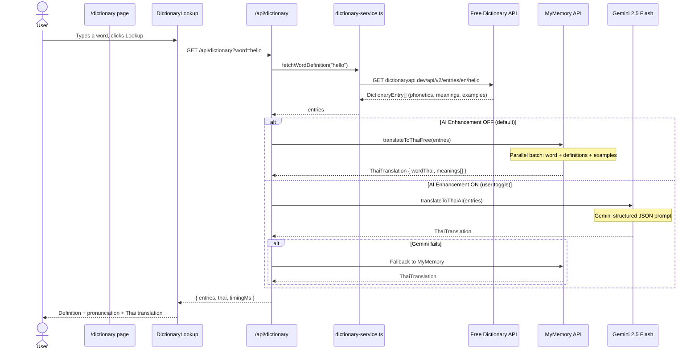
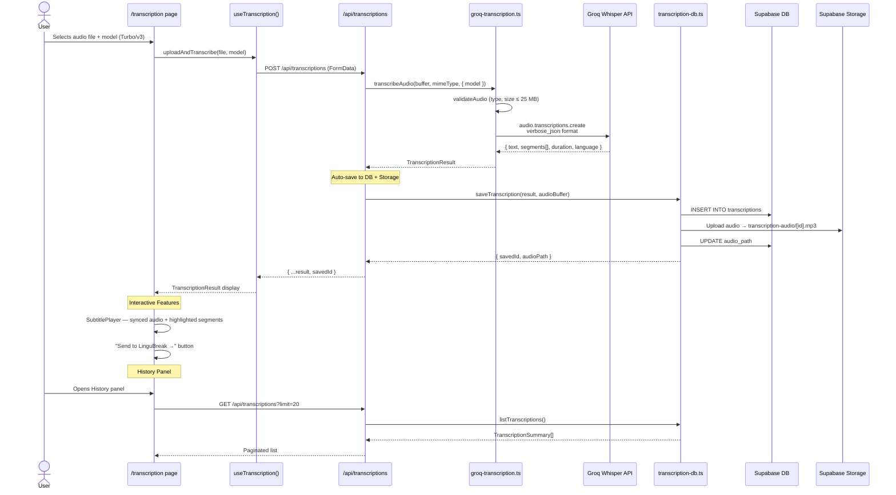
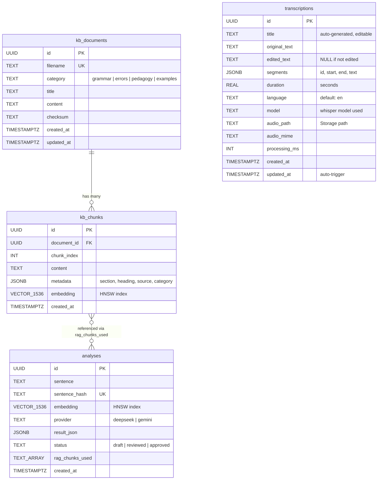
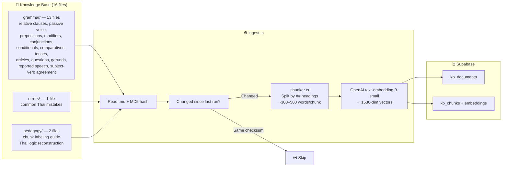
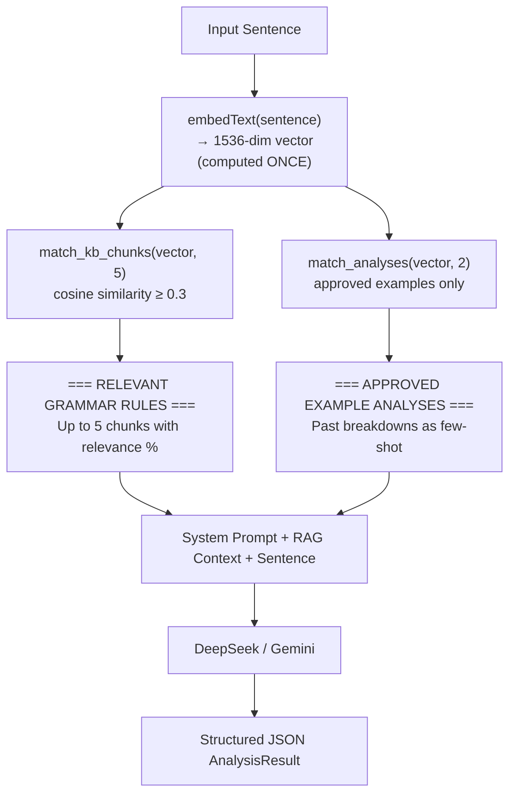
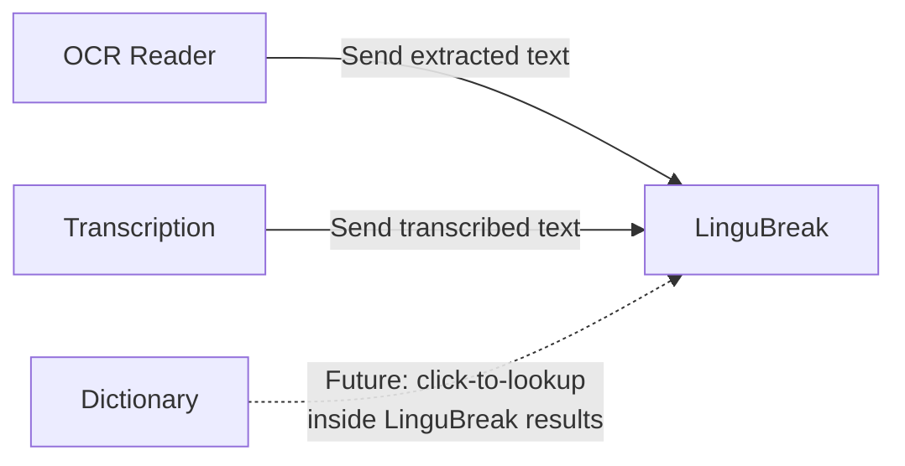

# Caffaine — Complete System Architecture

> **AI-powered English learning tools for Thai students.**
> Last updated: 2026-03-04

---

## 1. High-Level System Overview


```mermaid
graph TB
    subgraph "🖥️ App Router — src/app/"
        LAYOUT["layout.tsx — Global Shell"]
        HOME["page.tsx — Home Dashboard"]
        PG_LB["/lingubreak — Sentence Breakdown"]
        PG_OCR["/ocr — OCR Reader"]
        PG_DICT["/dictionary — Word Lookup"]
        PG_TX["/transcription — Audio Transcription"]
    end

    subgraph "🧩 Feature Modules — src/features/"
        F_LB["lingubreak/<br/>ChunkDisplay · StepAccordion<br/>ComparisonView · ReconstructionView<br/>SentenceInput · ModelSwitcher<br/>useAnalyze · ai-providers · schema"]
        F_OCR["ocr/<br/>ImageUploader · TextEditor<br/>useOcr"]
        F_DICT["dictionary/<br/>DictionaryLookup<br/>types"]
        F_TX["transcription/<br/>AudioUploader · TranscriptionResult<br/>SubtitlePlayer · TranscriptionHistory<br/>useTranscription · useAudioPlayer"]
    end

    subgraph "⚡ API Layer — src/app/api/"
        A_ANALYZE["/api/analyze — POST"]
        A_OCR["/api/ocr — POST"]
        A_DICT["/api/dictionary — GET"]
        A_TX1["/api/transcription — POST"]
        A_TX2["/api/transcriptions — GET · POST"]
        A_TX3["/api/transcriptions/id — GET · PUT · DELETE"]
    end

    subgraph "🛠️ Shared Services — src/shared/lib/"
        S_DB["db/supabase.ts<br/>Admin client"]
        S_RAG["rag/<br/>embeddings · retriever · chunker"]
        S_OCR["ocr/<br/>ocr-service (Gemini Vision)<br/>tesseract-ocr (client-side)"]
        S_DICT["dictionary/<br/>dictionary-service (Free Dict API)<br/>mymemory-service (free MT)<br/>translate-service (Gemini AI)"]
        S_TX["transcription/<br/>groq-transcription<br/>transcription-db<br/>transcription-types"]
    end

    subgraph "🗄️ Supabase"
        DB_KBD["kb_documents"]
        DB_KBC["kb_chunks<br/>+ 1536-dim vectors"]
        DB_ANA["analyses<br/>+ 1536-dim vectors"]
        DB_TX["transcriptions"]
        STORE["Storage Bucket<br/>transcription-audio"]
        RPC1["match_kb_chunks()"]
        RPC2["match_analyses()"]
    end

    subgraph "🤖 External APIs"
        EX_DS["DeepSeek Chat"]
        EX_GEM["Gemini 2.5 Flash<br/>(NLP · Vision · Translation)"]
        EX_OAI["OpenAI Embeddings<br/>text-embedding-3-small"]
        EX_GROQ["Groq Whisper<br/>(Turbo · v3)"]
        EX_FD["Free Dictionary API"]
        EX_MM["MyMemory Translation"]
    end

    subgraph "📖 Knowledge Base"
        KB["16 Markdown files<br/>grammar · errors · pedagogy"]
    end

    subgraph "🔧 Scripts"
        SC_ING["ingest.ts"]
        SC_SQL["setup-db.sql<br/>create-transcriptions-table.sql<br/>migrate-*.sql"]
    end

    HOME --> PG_LB & PG_OCR & PG_DICT & PG_TX

    PG_LB --> F_LB
    PG_OCR --> F_OCR
    PG_DICT --> F_DICT
    PG_TX --> F_TX

    F_LB --> A_ANALYZE
    F_OCR -.->|"Tesseract: client-side"| S_OCR
    F_OCR -->|"Gemini: server"| A_OCR
    F_DICT --> A_DICT
    F_TX --> A_TX2

    A_ANALYZE --> S_RAG
    A_ANALYZE --> EX_DS & EX_GEM
    A_ANALYZE --> DB_ANA
    A_OCR --> S_OCR
    S_OCR --> EX_GEM
    A_DICT --> S_DICT
    S_DICT --> EX_FD & EX_MM & EX_GEM
    A_TX1 & A_TX2 --> S_TX
    S_TX --> EX_GROQ
    A_TX2 & A_TX3 --> S_TX
    S_TX --> DB_TX & STORE

    S_RAG --> EX_OAI
    S_RAG --> RPC1 & RPC2
    RPC1 --> DB_KBC
    RPC2 --> DB_ANA
    S_DB --> DB_KBD & DB_KBC & DB_ANA & DB_TX

    SC_ING --> KB
    SC_ING --> EX_OAI
    SC_ING --> DB_KBD & DB_KBC
```

---

## 2. Feature Request Flows

### 2a. LinguBreak — Sentence Breakdown


```mermaid
sequenceDiagram
    actor Student
    participant UI as /lingubreak page
    participant Hook as useAnalyze()
    participant API as /api/analyze
    participant Engine as ai-providers.ts
    participant Cache as analyses table
    participant RAG as retriever.ts
    participant Embed as embeddings.ts
    participant KB as kb_chunks (RPC)
    participant Past as analyses (RPC)
    participant LLM as DeepSeek / Gemini

    Student->>UI: Submits English sentence
    UI->>Hook: analyze(sentence, provider)
    Hook->>API: POST /api/analyze

    API->>Engine: analyzeSentence(sentence, provider)

    Note over Engine: Step 1 — Cache Check
    Engine->>Cache: SELECT WHERE sentence_hash = ?
    alt Cache HIT ✅
        Cache-->>Engine: result_json
        Engine-->>API: Cached AnalysisResult
        API-->>UI: Instant response ($0 cost)
    end

    Note over Engine: Step 2 — RAG Retrieval
    Engine->>RAG: getRAGContext(sentence)
    RAG->>Embed: embedText(sentence)
    Embed->>Embed: OpenAI text-embedding-3-small → 1536-dim

    par Parallel Search (shared embedding)
        RAG->>KB: match_kb_chunks(vector, 5)
        KB-->>RAG: Top 5 grammar chunks
    and
        RAG->>Past: match_analyses(vector, 2)
        Past-->>RAG: Top 2 approved examples
    end

    RAG-->>Engine: { context, chunkIds }

    Note over Engine: Step 3 — LLM Generation
    Engine->>LLM: System Prompt + RAG Context + Sentence
    LLM-->>Engine: Structured JSON (chunks, steps, thai_translation)

    Note over Engine: Step 4 — Cache Write (async)
    Engine-)Cache: UPSERT { sentence, hash, embedding, result_json }

    Engine-->>API: AnalysisResult
    API-->>Hook: JSON
    Hook-->>UI: Renders ChunkDisplay + StepAccordion + ComparisonView + ReconstructionView
```

**Key design details:**

- Two LLM providers: **DeepSeek Chat** (default, fast & cheap) and **Gemini 2.5 Flash** (structured output via `responseSchema`)
- Embedding computed **once** and shared across both KB retrieval and past-analysis retrieval
- Cache is keyed by a hash of the normalized sentence; cache miss costs ~$0.001
- RAG degrades gracefully — if Supabase or OpenAI is unreachable, falls back to prompt-only mode

---

### 2b. OCR — Image Text Extraction (Dual-Provider)


```mermaid
sequenceDiagram
    actor User
    participant UI as /ocr page
    participant Hook as useOcr()

    alt Provider = Tesseract (default, free)
        Note over UI,Hook: Client-side — no server call
        Hook->>Hook: extractTextLocal(file)
        Hook->>Hook: Tesseract.js WASM<br/>recognizing text (with progress %)
        Hook-->>UI: OcrResult { text, confidence, processingTimeMs }
    else Provider = Gemini (toggle on)
        Hook->>API: POST /api/ocr (FormData)
        participant API as /api/ocr
        participant Svc as ocr-service.ts
        participant LLM as Gemini 2.5 Flash Vision
        API->>Svc: extractText(buffer, mimeType)
        Svc->>LLM: Image (base64) + Smart/Text prompt
        LLM-->>Svc: JSON { paragraphs[], confidence }
        Svc-->>API: OcrResult
        API-->>Hook: JSON
        Hook-->>UI: OcrResult
    end

    UI->>UI: TextEditor — edit, copy, or "Send to LinguBreak →"
```

**Key design details:**

- **Tesseract.js** (v7): Free, runs entirely in the browser via WebAssembly. ~85–92% accuracy. Reports real-time progress percentage
- **Gemini Vision**: Higher accuracy, server-side, uses API quota. Two modes: `smart` (ignores headers/footers) and `text` (raw extraction)
- Accepts JPEG, PNG, WebP up to 10 MB
- Cross-feature integration: extracted text can be sent directly to LinguBreak for sentence analysis

---

### 2c. Dictionary — Word Lookup with Thai Translation


```mermaid
sequenceDiagram
    actor User
    participant UI as /dictionary page
    participant Component as DictionaryLookup
    participant API as /api/dictionary
    participant Dict as dictionary-service.ts
    participant FreeAPI as Free Dictionary API
    participant MT as MyMemory API
    participant AI as Gemini 2.5 Flash

    User->>Component: Types a word, clicks Lookup
    Component->>API: GET /api/dictionary?word=hello

    API->>Dict: fetchWordDefinition("hello")
    Dict->>FreeAPI: GET dictionaryapi.dev/api/v2/entries/en/hello
    FreeAPI-->>Dict: DictionaryEntry[] (phonetics, meanings, examples)
    Dict-->>API: entries

    alt AI Enhancement OFF (default)
        API->>MT: translateToThaiFree(entries)
        Note over MT: Parallel batch: word + definitions + examples
        MT-->>API: ThaiTranslation { wordThai, meanings[] }
    else AI Enhancement ON (user toggle)
        API->>AI: translateToThaiAI(entries)
        Note over AI: Gemini structured JSON prompt
        AI-->>API: ThaiTranslation
        alt Gemini fails
            API->>MT: Fallback to MyMemory
            MT-->>API: ThaiTranslation
        end
    end

    API-->>Component: { entries, thai, timingMs }
    Component-->>User: Definition + pronunciation + Thai translation
```

**Key design details:**

- **Free Dictionary API**: Zero-cost, no auth, `force-cache` for repeated lookups. ~100–300ms latency
- **MyMemory API**: Free machine translation (en→th). Definitions are cleaned before translation (strip parentheticals, trim) for higher MT quality
- **Gemini AI translation**: Optional, user-activated. Produces higher quality Thai but consumes API quota. Falls back to MyMemory on failure
- Part-of-speech labels mapped to Thai equivalents via static lookup (คำนาม, คำกริยา, etc.)

---

### 2d. Transcription — Audio to Text with Playback


```mermaid
sequenceDiagram
    actor User
    participant UI as /transcription page
    participant Hook as useTranscription()
    participant API as /api/transcriptions
    participant Svc as groq-transcription.ts
    participant Groq as Groq Whisper API
    participant DB as transcription-db.ts
    participant Supa as Supabase DB
    participant Store as Supabase Storage

    User->>UI: Selects audio file + model (Turbo/v3)
    UI->>Hook: uploadAndTranscribe(file, model)
    Hook->>API: POST /api/transcriptions (FormData)

    API->>Svc: transcribeAudio(buffer, mimeType, { model })
    Svc->>Svc: validateAudio (type, size ≤ 25 MB)
    Svc->>Groq: audio.transcriptions.create<br/>verbose_json format
    Groq-->>Svc: { text, segments[], duration, language }

    Svc-->>API: TranscriptionResult

    Note over API: Auto-save to DB + Storage
    API->>DB: saveTranscription(result, audioBuffer)
    DB->>Supa: INSERT INTO transcriptions
    DB->>Store: Upload audio → transcription-audio/[id].mp3
    DB->>Supa: UPDATE audio_path
    DB-->>API: { savedId, audioPath }

    API-->>Hook: { ...result, savedId }
    Hook-->>UI: TranscriptionResult display

    Note over UI: Interactive Features
    UI->>UI: SubtitlePlayer — synced audio + highlighted segments
    UI->>UI: "Send to LinguBreak →" button

    Note over UI: History Panel
    User->>UI: Opens History panel
    UI->>API: GET /api/transcriptions?limit=20
    API->>DB: listTranscriptions()
    DB-->>API: TranscriptionSummary[]
    API-->>UI: Paginated list
```

**Key design details:**

- **Groq Whisper**: Two models — `whisper-large-v3-turbo` (fast, $0.04/hr, default) and `whisper-large-v3` (high accuracy, $0.111/hr)
- Supports MP3, WAV, M4A, OGG, FLAC, WebM up to 25 MB
- Returns time-stamped segments for subtitle-style playback with `SubtitlePlayer`
- Full CRUD: create, list, get, update (edited text/title), delete (with storage cleanup)
- Audio files stored in Supabase Storage bucket `transcription-audio` with public URLs for `<audio>` playback
- Auto-generated title from first 50 chars of transcribed text
- History panel with load-from-history capability
- Cross-feature: transcribed text can be sent to LinguBreak for analysis

---

## 3. Database Schema


```mermaid
erDiagram
    kb_documents {
        UUID id PK
        TEXT filename UK
        TEXT category "grammar | errors | pedagogy | examples"
        TEXT title
        TEXT content
        TEXT checksum
        TIMESTAMPTZ created_at
        TIMESTAMPTZ updated_at
    }

    kb_chunks {
        UUID id PK
        UUID document_id FK
        INT chunk_index
        TEXT content
        JSONB metadata "section, heading, source, category"
        VECTOR_1536 embedding "HNSW index"
        TIMESTAMPTZ created_at
    }

    analyses {
        UUID id PK
        TEXT sentence
        TEXT sentence_hash UK
        VECTOR_1536 embedding "HNSW index"
        TEXT provider "deepseek | gemini"
        JSONB result_json
        TEXT status "draft | reviewed | approved"
        TEXT_ARRAY rag_chunks_used
        TIMESTAMPTZ created_at
    }

    transcriptions {
        UUID id PK
        TEXT title "auto-generated, editable"
        TEXT original_text
        TEXT edited_text "NULL if not edited"
        JSONB segments "id, start, end, text"
        REAL duration "seconds"
        TEXT language "default: en"
        TEXT model "whisper model used"
        TEXT audio_path "Storage path"
        TEXT audio_mime
        INT processing_ms
        TIMESTAMPTZ created_at
        TIMESTAMPTZ updated_at "auto-trigger"
    }

    kb_documents ||--o{ kb_chunks : "has many"
    kb_chunks }o--o{ analyses : "referenced via rag_chunks_used"
```

**Supabase RPC Functions:**

| Function            | Purpose                                 | Parameters                                          |
| ------------------- | --------------------------------------- | --------------------------------------------------- |
| `match_kb_chunks()` | Cosine similarity search on `kb_chunks` | `query_embedding`, `match_count`, `filter_category` |
| `match_analyses()`  | Find similar approved past analyses     | `query_embedding`, `match_count`                    |

**Supabase Storage:**

| Bucket                | Purpose                                | Access                          |
| --------------------- | -------------------------------------- | ------------------------------- |
| `transcription-audio` | Audio files uploaded for transcription | Public (for `<audio>` playback) |

---

## 4. Knowledge Base & RAG Pipeline

### Ingestion (scripts/ingest.ts)


```mermaid
flowchart LR
    subgraph "📖 Knowledge Base (16 files)"
        G["grammar/ — 13 files<br/>relative clauses, passive voice,<br/>prepositions, modifiers, conjunctions,<br/>conditionals, comparatives, tenses,<br/>articles, questions, gerunds,<br/>reported speech, subject-verb agreement"]
        E["errors/ — 1 file<br/>common Thai mistakes"]
        P["pedagogy/ — 2 files<br/>chunk labeling guide<br/>Thai logic reconstruction"]
    end

    subgraph "⚙️ ingest.ts"
        READ["Read .md + MD5 hash"]
        CHK["Changed since last run?"]
        CHUNK["chunker.ts<br/>Split by ## headings<br/>~300–500 words/chunk"]
        EMBED["OpenAI text-embedding-3-small<br/>→ 1536-dim vectors"]
    end

    subgraph "🗄️ Supabase"
        DOC["kb_documents"]
        CHUNKS["kb_chunks + embeddings"]
    end

    G & E & P --> READ
    READ --> CHK
    CHK -->|"Changed"| CHUNK --> EMBED --> DOC & CHUNKS
    CHK -->|"Same checksum"| SKIP["⏭️ Skip"]
```

### RAG Context Construction


```mermaid
flowchart TD
    INPUT["Input Sentence"]
    INPUT --> EMB["embedText(sentence)<br/>→ 1536-dim vector<br/>(computed ONCE)"]

    EMB --> S1["match_kb_chunks(vector, 5)<br/>cosine similarity ≥ 0.3"]
    EMB --> S2["match_analyses(vector, 2)<br/>approved examples only"]

    S1 --> CTX1["=== RELEVANT GRAMMAR RULES ===<br/>Up to 5 chunks with relevance %"]
    S2 --> CTX2["=== APPROVED EXAMPLE ANALYSES ===<br/>Past breakdowns as few-shot"]

    CTX1 & CTX2 --> PROMPT["System Prompt + RAG Context + Sentence"]
    PROMPT --> LLM["DeepSeek / Gemini"]
    LLM --> OUT["Structured JSON AnalysisResult"]
```

---

## 5. External API Integration Map

| API                           | Provider                | Used By                                                  | Auth               | Cost Model                |
| ----------------------------- | ----------------------- | -------------------------------------------------------- | ------------------ | ------------------------- |
| DeepSeek Chat                 | DeepSeek                | LinguBreak (NLP)                                         | `DEEPSEEK_API_KEY` | Pay-per-token             |
| Gemini 2.5 Flash              | Google                  | LinguBreak (NLP), OCR (Vision), Dictionary (Translation) | `GEMINI_API_KEY`   | Free tier / pay-per-token |
| OpenAI text-embedding-3-small | OpenAI                  | RAG embeddings (1536-dim)                                | `OPENAI_API_KEY`   | ~$0.02/1M tokens          |
| Groq Whisper                  | Groq                    | Transcription                                            | `GROQ_API_KEY`     | Free tier (~2K req/day)   |
| Free Dictionary API           | dictionaryapi.dev       | Dictionary lookup                                        | None (public)      | Free, unlimited           |
| MyMemory Translation          | mymemory.translated.net | Dictionary (en→th)                                       | None (public)      | Free, rate-limited        |

---

## 6. Feature Module Architecture

```text
src/
├── app/                              # Next.js App Router
│   ├── layout.tsx                    # Global shell (dark theme, HUD grid)
│   ├── page.tsx                      # Home — feature card dashboard
│   ├── lingubreak/page.tsx           # LinguBreak UI
│   ├── ocr/page.tsx                  # OCR UI
│   ├── dictionary/page.tsx           # Dictionary UI (test page)
│   ├── transcription/page.tsx        # Transcription UI
│   ├── globals.css                   # Design tokens + brutal theme
│   └── api/
│       ├── analyze/route.ts          # POST — sentence analysis
│       ├── ocr/route.ts             # POST — OCR (Gemini Vision)
│       ├── dictionary/route.ts       # GET  — word lookup + translation
│       ├── transcription/route.ts    # POST — transcribe only
│       ├── transcriptions/route.ts   # GET (list) · POST (transcribe + save)
│       └── transcriptions/[id]/route.ts  # GET · PUT · DELETE
│
├── config/
│   └── features.ts                   # Feature registry + flags
│
├── features/                         # Self-contained vertical slices
│   ├── lingubreak/
│   │   ├── components/               # ChunkDisplay, StepAccordion, ComparisonView,
│   │   │                             # ReconstructionView, SentenceInput, ModelSwitcher
│   │   ├── hooks/useAnalyze.ts
│   │   ├── lib/ai-providers.ts       # analyzeSentence(), provider logic, caching
│   │   └── lib/schema.ts            # AnalysisResult types + color map
│   │
│   ├── ocr/
│   │   ├── components/               # ImageUploader, TextEditor
│   │   └── hooks/useOcr.ts          # Dual-provider hook (Tesseract/Gemini)
│   │
│   ├── dictionary/
│   │   ├── components/DictionaryLookup.tsx
│   │   └── types.ts                 # DictionaryEntry, ThaiTranslation, etc.
│   │
│   └── transcription/
│       ├── components/               # AudioUploader, TranscriptionResult,
│       │                             # SubtitlePlayer, TranscriptionHistory
│       └── hooks/                    # useTranscription, useAudioPlayer
│
└── shared/                           # Cross-feature infrastructure
    ├── lib/
    │   ├── db/supabase.ts           # Admin client (service role)
    │   ├── rag/
    │   │   ├── embeddings.ts        # OpenAI embeddings (with timeout)
    │   │   ├── retriever.ts         # buildRAGContext(), retrieveContext()
    │   │   └── chunker.ts          # Split markdown by ## headings
    │   ├── ocr/
    │   │   ├── ocr-service.ts      # Gemini Vision extraction (server)
    │   │   ├── tesseract-ocr.ts    # Tesseract.js extraction (client)
    │   │   ├── ocr-types.ts        # OcrResult, OcrError, OcrProvider
    │   │   └── index.ts            # Barrel export
    │   ├── dictionary/
    │   │   ├── dictionary-service.ts   # Free Dictionary API client
    │   │   ├── mymemory-service.ts     # MyMemory free translation
    │   │   └── translate-service.ts    # Gemini AI translation (optional)
    │   └── transcription/
    │       ├── groq-transcription.ts   # Groq Whisper API client
    │       ├── transcription-db.ts     # CRUD + Storage (save, list, get, update, delete)
    │       ├── transcription-types.ts  # Types, errors, constants
    │       └── index.ts               # Barrel export (server-safe)
    └── components/                    # Shared UI components
```

---

## 7. Environment Variables

| Variable                    | Required By                                         | Purpose                 |
| --------------------------- | --------------------------------------------------- | ----------------------- |
| `GEMINI_API_KEY`            | LinguBreak, OCR (Gemini mode), Dictionary (AI mode) | Google Gemini 2.5 Flash |
| `DEEPSEEK_API_KEY`          | LinguBreak                                          | DeepSeek Chat API       |
| `OPENAI_API_KEY`            | RAG pipeline, Ingestion script                      | OpenAI Embeddings       |
| `GROQ_API_KEY`              | Transcription                                       | Groq Whisper API        |
| `NEXT_PUBLIC_SUPABASE_URL`  | All DB/Storage features                             | Supabase project URL    |
| `SUPABASE_SERVICE_ROLE_KEY` | All DB/Storage features                             | Supabase admin access   |

---

## 8. Feature Status & Roadmap

| Feature                   | Status     | Route            | Primary Provider    | Fallback               |
| ------------------------- | ---------- | ---------------- | ------------------- | ---------------------- |
| **LinguBreak**            | ✅ Live    | `/lingubreak`    | DeepSeek Chat       | Gemini 2.5 Flash       |
| **Transcription**         | ✅ Live    | `/transcription` | Groq Whisper Turbo  | Whisper v3 (toggle)    |
| **OCR Reader**            | 🧪 Demo    | `/ocr`           | Tesseract.js (free) | Gemini Vision (toggle) |
| **Dictionary**            | 🧪 Test    | `/dictionary`    | Free Dictionary API | MyMemory → Gemini AI   |
| Document Reader           | 📋 Planned | —                | —                   | —                      |
| Batch Textbook Processing | 📋 Planned | —                | —                   | —                      |

### Cross-Feature Integrations


```mermaid
graph LR
    OCR["OCR Reader"] -->|"Send extracted text"| LB["LinguBreak"]
    TX["Transcription"] -->|"Send transcribed text"| LB
    DICT["Dictionary"] -.->|"Future: click-to-lookup<br/>inside LinguBreak results"| LB
```

---

## 9. Tech Stack Summary

| Layer        | Technology                       | Version     |
| ------------ | -------------------------------- | ----------- |
| Framework    | Next.js (App Router)             | 16.1.6      |
| Language     | TypeScript                       | 5.x         |
| UI           | React + TailwindCSS              | 19.2.3 / v4 |
| Database     | Supabase (PostgreSQL + pgvector) | —           |
| Embeddings   | OpenAI text-embedding-3-small    | 1536-dim    |
| Vector Index | HNSW (pgvector)                  | —           |
| OCR (client) | Tesseract.js                     | 7.x         |
| Icons        | Lucide React                     | 0.574.x     |
| AI SDK       | @google/generative-ai            | 0.24.x      |
| Audio AI     | groq-sdk                         | 0.37.x      |

---

## 10. Architecture Review (Reality Check vs Diagram)

This document’s diagrams are broadly accurate, but the codebase currently includes additional production surfaces that matter for scalability and cost:

- **Teacher/admin domain**: `src/app/(admin)` + `/api/admin/**` for folders/lessons/segments and translation jobs.
- **Auth + role enforcement**: `src/middleware.ts` refreshes Supabase sessions and gates `/dashboard` and `/api/admin/*` to teacher/admin users.
- **“Background” translation is in-process**: `/api/admin/translate/bulk` starts `processJobInBackground(...)` as a detached promise in the same Next.js runtime. This is **not a durable worker** on serverless platforms.

---

## 11. Constraints & Bottlenecks (Observed in Code)

### 11a. Latency-critical synchronous paths

- **`POST /api/analyze` (cache miss)** does: embedding → 2 RPC vector searches → LLM generation → returns full JSON. This compounds latency and increases timeout risk under load.
- **`POST /api/transcriptions` (save path)** does: Groq transcription → DB insert → Storage upload → DB update, increasing tail latency and failure surface.
- **`POST /api/ocr`** base64 encodes images and calls Gemini Vision synchronously (large payload, provider latency).

### 11b. Token-cost drivers

- RAG prompt includes **full KB chunk text** (up to 5 chunks) and **pretty-printed JSON** for past analyses. This can dominate prompt tokens vs the user sentence.

### 11c. Provider + platform limits

- External API rate limits (429) and quotas apply to **DeepSeek**, **Gemini**, **OpenAI embeddings**, **Groq**.
- Next.js/serverless runtimes have **execution time limits**; detached promises may be terminated early (especially for “background jobs”).

### 11d. Correctness & cache integrity risks

- `hashSentence()` is a weak non-cryptographic hash (collision risk). Collisions can cause **wrong cache hits** (bad UX) and invalidate measurement of cache effectiveness.
- Cache keys do not currently include **prompt/schema/model/KB versioning**, which risks serving stale outputs after prompt or schema changes.

---

## 12. Optimization Plan (Maximize Speed, Minimize Token Cost)

### 12a. “Low effort / high ROI” changes

- **Eliminate double embeddings** on LinguBreak cache writes: reuse the embedding computed during RAG retrieval instead of embedding again during `cacheAnalysis()`. This reduces both latency (background load) and embedding spend.
- **Add a strict RAG token budget**:
  - cap the total RAG context (KB + examples) by tokens
  - prefer fewer, higher-similarity chunks over many weak matches
  - compress past analyses to only the fields needed to guide formatting (avoid `JSON.stringify(..., null, 2)`).
- **Tighten retrieval thresholds**:
  - increase `minSimilarity` (or make it adaptive) to reduce irrelevant context and prompt bloat
  - reduce `topK` when similarity is low or the token budget is hit.
- **Introduce cache versioning**: include `prompt_version`, `schema_version`, and `kb_version/checksum` in cache lookup/write so changes don’t silently degrade behavior.

### 12b. Caching strategy (cost + latency)

- **3-tier caching for analyze**:
  - L1: exact hash cache (existing `analyses`)
  - L2: semantic cache (embedding similarity over approved analyses; only above a strict threshold)
  - L3: full generation (LLM).
- **Provider response caching**:
  - cache embeddings for repeated identical sentences (or short normalized variants)
  - cache translation of lesson segments (idempotent per segment + provider + prompt version).

### 12c. Concurrency control & “bulkheads”

- Add server-side caps per provider/endpoint (e.g., max concurrent `analyze`, max concurrent `bulk translate`), so one hot path cannot starve others.
- Prefer **admission control** (fast fail or queue) over letting requests pile up and time out.

### 12d. Prompt minimization techniques

- **RAG context shaping**:
  - include headings + 1–3 key paragraphs rather than full sections
  - de-duplicate headings/boilerplate across chunks
  - drop “relevance: 83%” style lines unless empirically beneficial.
- **Late chunking / highlighting**:
  - retrieve larger sections, but inject only the most relevant sentences at prompt time to reduce tokens.

---

## 13. Scalability & Operations (What We Need for Production Scale)

### 13a. Durable background processing

Replace in-process detached jobs with a durable worker model:

- **Option A (Supabase-native)**: Edge Function(s) + jobs table + retries/backoff + idempotency.
- **Option B (Queue + worker)**: managed queue (e.g., QStash/Redis/BullMQ) + separate worker deployment.

Minimum required semantics:

- **idempotency keys** per segment/job (safe retries)
- **retry policy** with exponential backoff + jitter
- **dead-letter** handling for persistent failures
- **progress accounting** that doesn’t bloat a single JSON field (store per-segment results; aggregate on read).

### 13b. Rate limiting & quotas

- **Inbound**: per-IP (public endpoints), per-user/session (teacher tools), and per-route class (LLM-heavy vs light).
- **Outbound**: provider-specific concurrency caps + circuit breakers to prevent cascading failures.

### 13c. Observability (to control latency + cost)

Add first-class telemetry:

- **Metrics**: RPS, p50/p95/p99 latency per route, cache hit rate (L1/L2), token usage per provider, embedding call counts, provider 429 rates, Supabase RPC durations.
- **Tracing**: request → embedding → RPC(s) → LLM call(s), with correlation IDs returned to clients for support.
- **Logging**: structured JSON logs with redaction policy (no raw user text for admins by default; no secrets; sample high-volume logs).

### 13d. SLOs (starter targets)

- **Lesson read APIs** (cached): p95 < 300ms.
- **Analyze**:
  - cache hit: p95 < 400ms
  - cache miss: prefer 202 “job accepted” within < 500ms; completion depends on provider latency.
- **Bulk translate**: job acceptance < 500ms; progress updates every batch; completion time bounded by provider quotas.

---

## 14. “Better AI Engine” Options Beyond Current RAG

The current design is a classic embedding + vector search + prompt injection RAG. For this product, quality/cost often improves more by **routing + compression** than by “more chunks”.

### 14a. Hybrid retrieval (recommended next step)

- Combine **vector search (pgvector)** with **lexical search (Postgres full-text / BM25-like ranking)** and merge results (e.g., reciprocal rank fusion).
- Why it helps here: grammar KB content contains explicit terms (“relative clauses”, “articles”, “reported speech”) where lexical matching boosts recall and reduces irrelevant vector matches.

### 14b. Topic routing (RAG + rules engine)

- Add a lightweight “topic classifier” (cheap model or heuristics) to route queries to:
  - a subset of KB categories/tags
  - specialized prompts (articles vs tenses vs relative clauses)
  - different retrieval depths (no retrieval for trivial sentences).

### 14c. Reranking (late interaction)

- Retrieve more candidates (e.g., top 20), then rerank to top 3–5 via:
  - a small cross-encoder reranker (if hosting is acceptable), or
  - a cheap LLM “select best passages” step with a strict token budget.

### 14d. Fine-tuning / distillation (when scale justifies it)

- For stable JSON outputs and a fixed pedagogy format, consider:
  - distilling a smaller model (or fine-tuning) to reduce per-request tokens and improve determinism
  - keeping RAG as “exception handler” only when confidence is low.

### 14e. Semantic cache as an “engine”

- Treat prior approved analyses as a first-class asset:
  - semantic reuse above high similarity thresholds
  - optionally regenerate only the Thai translation or only step 3/4 when needed.

